# Requested updates

| Error | Solution | Fixed (Y/N) |
| --- | --- | --- |
| blank input possibility | provide a correct blank input response | Y |
| name/phone number accepts blank input | provide blank input response and alternative | Y |
| Ineffextive error statements | report any errors to the user through raised statement | Y |
| invalid data can be entered | add error handling to prevent this | Y |
| Insufficient Readme | testing section lacks adequate details + not working pictures | Y |
| Readme error testing | detailed manual testing steps and guidelines are missing | Y |
| Readme add planning for project’s logic - flow charts / diagrams | add created flow charts | Y |

 
 

# Lou's nail studio - about the page
This project is a simple booking system for a fictional nail studio called "Lou's nail studio." The aim of the system is to allow for bookings to be made, existing bookings being edited and existing bookings being cancelled. All tracked and updated in a Google Sheet database. The tool and database is accessable online, so can be viewed when on the move and is not bound to a specific machine. By using Google sheets, the user will have several options to extend it's functionalities. For example linking it to their Gmail or Google calendar.

The project is hosted on Github and deployed on Heroku for easy access, sharing and collaboration. 

[Live site](https://lous-nailstudio-booking-system-72021c02bd05.herokuapp.com/)

[Repository link](https://github.com/MJRidder/nailstudio_booking)

## Table of Contents

1. [User Experience](#user-experience)
2. [Design and Planning](#design-and-planning)
3. [Features](#features)
4. [Future Features](#future-features)
5. [Google spreadsheet with integrated api](#google-spreadsheet-with-integrated-api)
6. [Google Sheets](#google-sheets)
7. [Testing](#testing)
8. [Deployment](#deployment)
9. [Unfixed bugs](#unfixed-bugs)
10. [Credits](#credits)

## User experience 

### Business goals (project goals)
This Booking system has been written with small business owners in mind. I took a nail studio as an example, however the goal of this system is to make it accessable for any small company, looking to have their own booking system. Simply by copy/pasting the code and translate the verbiage of the tool, to the specific small business owner. With that in mind the goal is for each function to do something specific and have a handfull of main choice options call on these functions one by one. The booking system therefor had the following focus points when created:

* Have a simple online tool that allows for:
    - business to be generated (bookings) at any given time of the day
    - existing bookings to be updated as per clients preference (without need for human interaction)
    - tracking of all upcoming bookings (dates & times)
    - an overview of all cancelled bookings
    - integration with a back end database (Google Sheets)
* Clients to book/edit/cancel bookings without human interaction
* Have a tool that integrates easily with a front-end website
* Have a tool that can be used in collaboration with other functions (email/calendar planning)

### User Stories
This Nail studio booking system has been developed to allow for clients of "Lou's nail studio" to check for availability, review their own bookings and to make/edit bookings at any point in time that they desire. Allowing for flexibility and on online option for such adjustments. Which is especially relevant today where people are less likely to pick up the phone. Or at the very least, less enjoy doing so.

* Quick and easy booking of nail appointments
* Quick and easy editing/cancelling of existing bookings
* Quick and easy way to check availability for a nail appointment
* Ability to make a booking at any given moment in time
* To get feedback on my input in the program
* For it to be clear what the programs function is

[Back to Table of Contents](#table-of-contents)

## Design and Planning 
The design has purposefully been kept simple and to the point. Not asking the user for extensive answers, but navigating through the system by answering with 2-4 option buttons (letter, date or times). Formatting of how an answer is expected is clarified before each question. It is also repeated where this is needed.

Every step in the process has been reviewed for the users best experience. Ensuring they have options to go back to the main menu with every question. Giving them the ability to go back and not get stuck in the system.

The different flowchars have been written out up front, reviewing what functions would be needed (individual cells in the overview) and what functions would overlap between functions (reviewable in the same columns in the overview)

**Flowchart of making a booking**
   

   
Click to Expand.

   
   

 

**Flowchart of editing a booking**
   

   
Click to Expand.

   
   

 

**Flowchart of canceling a booking**
   

   
Click to Expand.

   
   

 

There has been made a concideration up front as well as to how the different flowcharts could make use of the same functions to avoid duplication

**Alignment of all flowcharts**
   

   
Click to Expand.

   
   

 

Every line of printed text is preceeded with the " $ " symbol to help destinguish the text from the side of the screen. The " $ " was used to copy the formatting of the love-sandwitches example from the CI course.

### Colorama
Added Colorama colors to the program, indicating user input, error and success messaging. It also highlights the different menu's that the user can apporoach and the questions asked to the user.

[Back to Table of Contents](#table-of-contents)

## Features 

### Welcome message + navigation menu
The user is welcomed to the booking system with a simple message. Providing information about Lou's Nail studio, specifically about it's opening days. It also provides the user with the initial options. Keeping it clean and tight as this system is only used to navigate bookings. It is expected that further information is presented on the front-end webiste.

**Initial menu + navigation**
   

   
Click to Expand. - Initial menu + navigation

   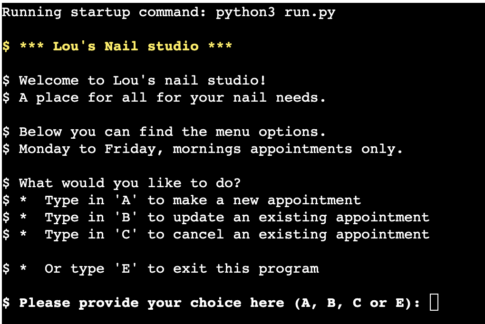
   

 

### Google Sheets database
To ensure the booking system has all the right data for bookings, a Google sheet database has been created. A simple worksheet containing two spreadsheets. Containing all data to translate to the booking system, but also containing the working data for Lou's nail studio to track their active and cancelled bookings.

1) **available_dates_times** : In this overview, all available dates and times have been pre-added, all the way to 2027/07/27. Each date has three time slots available for bookings (9:00, 10:00 & 11:00). Also only weekdays have been added, not the weekends. By pre-populating this, the system knows where availability is for the Nail studio. If the Nail studio does not want to be open on a specific date (e.g. bank holiday). The date can simply be removed. To make sure that dates are also available for the Nail studio, even if the availability for the clients has been removed, two "check columns" are added which hold the dates in case the Nail studio still wants to use them in the future.

 

2) **confirmed_bookings** : this overview showcases all bookings made. It shows which ones are scheduled but also which ones have been cancelled (or edited). When a booking, editing or cancellation has been completed, this sheet will showcase that. Allowing for the business owner to have a full overview of confirmed bookings. Planning their days accordingly.

### Make a booking
It is quick and easy to make a booking through this system. This feature takes you through the process, step-for-step.

**Make a booking feature**
   

   
Click to Expand. - Make a booking feature

   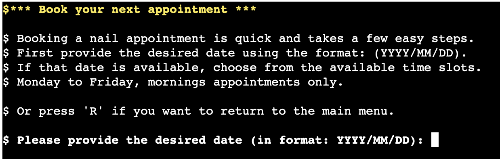
   

User facing:
*  First helping you by picking a date,
*  Checking it's availability (moves to the next step if it is, otherwise brings you back to step 1.)
*  Gives the available times on the desired date
*  Asks user to provide their first and last name
*  Asks user to provide their contact phone number
*  Creates a unique booking ID for the user to keep in case of questions or desire to edit at a later stage
*  Confirms all booking details back to the user

Back-end facing:
So while the user is making their booking, the following steps are taken when a booking is made, cancelled or edited.
*  All booking data is gathered through the Python functions, to then be added to a confirmed booking sheet. Specifically the following data: 
    - date
    - time
    - name
    - phone number
    - timestamp
    - booking confirmation
*  Chosen date & time are removed from the available dates & times sheet

This results in the chosen time no longer being available for the next users.

### Edit a booking
Allows the user to edit existing bookings. Users can edit the date, time and contact details of their booking. The steps are similar to making a booking, but are preceeded by a Booking ID check to ensure that the original booking is cancelled. All edits will then be saved for the user with a new booking number. 

By providing a new booking ID, there is no confusion on what booking is the most up-to-date. Old booking ID and their bookings are still viewable by Lou's nail studio however. This way they can track past bookings.

**Edit a booking feature**
   

   
Click to Expand. - Edit a booking feature

   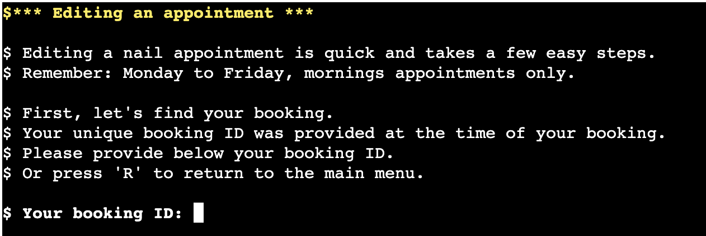
   

### Cancel a booking
This feature is purposefully also similar to the booking and editing feature. Asking the user for their booking ID, confirming that the right booking is being reviewed, before asking the user if sure that they are looking to cancel the booking. All with the intend of the user in mind. Avoiding cancellations to happen by accident.

**Cancel a booking feature**
   

   
Click to Expand. - Cancel a booking feature

   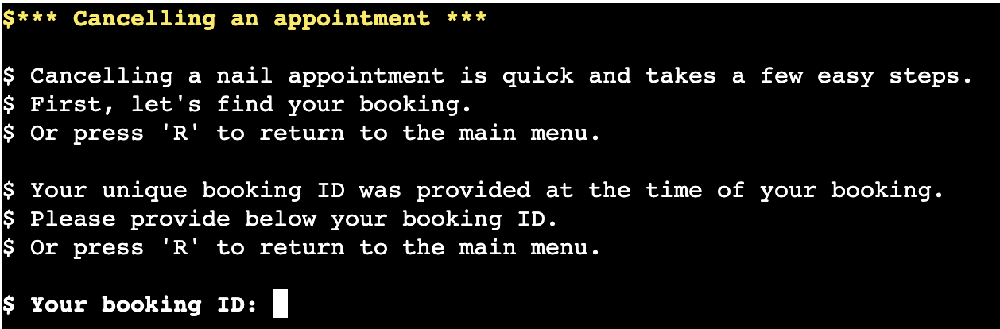
   

### Booking ID
Each booking and each followed iteration will receive a unique booking number. This booking number is unique generated with each completed action (booking or editing) by the user and is created by looking at the highest (last) booking number and adding 1. 

Booking ID's allow for the user to always have a clear reference for their booking when they reach out to Lou's nail studio. This to avoid confusion and to ensure any edits made, are made to the correct booking.

The booking ID's allow also for Lou's nail studio, to track their users activity and when a client reaches out to them (online or over the phone) to ensure that the correct booking is reviewed. This to avoid mistakes and confusion.

### Answer Validation
Most answer options in this booking system have been wrapped in if/else statements with the intentional purpose of keeping it simple. All menu options have 2-5 answer options with clear instruction. It is only when the user is asked to enter a date, a time or their contact details, further typing is required. With the date and time, clear instructions are provided to what to type and how. Their name and phone number are currently free text fields with no limitations. Names are names and people can be called what they want. But also phone numbers, especially if the tool would be used internationally, can have many different variations (incl. letters or symbols). For better user experience it is now chosen to keep this field open with an additional callout added to state the importance of a valid phone number. However, this could become more tailored if required in the future.

### Exit and Return options
Each page also has Exit or Return options. Users can make mistakes, or simply change their minds. These menu options allow users to step back from their current path in the navigation. Without having to quit (or 'kill') the booking system all together.

   
 
   
Click to Expand - Main menu return message

   
   

    
 
   
Click to Expand - Make a booking return message

   
   

    
 
   
Click to Expand - Edit a booking return message

   
   

    
 
   
Click to Expand - Cancel a booking return message

   
   
   

    
 
   
Click to Expand - Mid navigation return message

   
   

### Google sheets database
(more on this later) The G suite database allows for the tracking of appointments. Also where days are removed or added back in again manually, the booking system takes this into account automatically.

[Back to Table of Contents](#table-of-contents)

## Future features 

### Add (more) colors and other formatting
Adding additional color and formatting to the booking system will help with making it easer to read and with that, navigate.

### Add specific nail services to the booking system
Depending on the available nails services (these are not clear at this point), specific nail services could be added to the booking system. Making it possible for users to book a specific service. This will help with preparation and planning. However as it is currently unclear what services will be proviced. The booking system itself is now focusing on blocking of time slots.

### Add code that automatically deletes old available dates 
To make the booking system even more viable, a script could be written that would delete old 'date entries' that were BEFORE 'today'. This way no bookings can be made on old dates and confusion could be prevented. Currently these dates can be removed manually in the Google sheet. 

### Linking Google sheets database with Gmail
Be able to auto email clients from the system.

### Linking Google sheets database with Google calendar
Auto add/remove and update bookings in Google calendar based on client input in the system,

### Linking Google sheets database with Analytics
Track which days/times (in future: services) are most popular, should the offer of days be expanded?

### Saving Google sheets data separately to create user profiles
With the information present in Google sheets, user profiles and history can be build.

### Text/Choice options alignment
In some cases different wording is used throughout the system, for doing the same thing. Wording for these can be more streamlined and aligned.

### Break open larger functions
To become truely easy to copy/paste for smaller businesses, larger functions (like the "update_booking" function) can be broken open and taken apart in smaller steps/functions. To be used in a same way, but also in a more structured fashion.

### More concrete answer validation
At the moment it has been a conscious choice to keep the validating simple. Keeping the booking system simple and allowing for certain freedoms to user. This can however be updated if the owner of the booking system requires it.

### Tickbox column for dates/times
Instead of removing and adding dates/times that are booked, replace this function with a availability or a tickbox (similar to the confirmed bookings function). To avoid anything going wrong with adding/removing data from the sheet.

### Combining the available dates/times sheet with confirmed bookings
To have everyting available in one overview, both Google sheet spreadsheets could be combined into one. Having one single source of truth and a complete list view of all bookings. This has not yet been done as at the time of creation, it was not clear yet how cancellations could be made part of this as well. Which is why the choice was made to keep both separate for this version of the tool.

### Holding a date when a booking is made
At the moment when a date and time is selected (but before a name and phone number is provided) a booking is not held. Which in theory could mean that if two people at exactly the same time made a booking (or waited for some time after selecting the date/time) could overwrite each others booking. Chances are small but not 0%. So a "blocking of a date and time" could be put in place when they are selected. Which would only be valid for a limited amount of time (e.g. 5 minutes).

### Specific messaging for unavailable days
Currently the Google sheet only entails available days which would be removed when fully booked (and automatically replaced when bookings are cancelled). To provide additional information to the user, it will be helpfull to add ALL dates, including weekends/bank holidays. But to add a new error message when these days are booked. E.g.: Lou's Nail studio is closed on the weekends/this bankholiday. This could be achieved by adding a specific value on those days in the sheet and link a specific error message to that value. Similar as there is currently in place for "cancelled" bookings.

[Back to Table of Contents](#table-of-contents)

## Google spreadsheet with integrated api 

### Creating the Google Spreadsheet:

1. Log in: (or sign up) to your Google Account.
2. Access Google Spreadsheet: Navigate to Google Sheets.
3. Create a new spreadsheet: and give it a descriptive name, e.g., 'flexibook' like the name of the application.
4. Rename the worksheet: (e.g., 'confirmation') and add, if necessary, additional worksheets.
5. Add headings: (Confirmation code, day, time and name).

### Setting up the APIs:

1. **Navigate to the Google Cloud Platform:**
   - Create a new project by clicking the button "Select a project" and then selecting "New project."
   - Give the project a descriptive and meaningful name, e.g., flexibook, and click on the "CREATE" button.
   - In the Notifications pop-up, click on "SELECT PROJECT."
   
2. **On the project page:**
   - Go to the menu (click the burger icon in the top-left corner of the page), click on "APIs and services," and then select "Library."
   - In the search bar, search for "Google Drive" and enable it.
   - Click on "Credentials" in the sidebar and then select "+ CREATE CREDENTIALS > Help me choose."
   
3. **Credential setup:**
   - Select "Google Drive API" and "Application Data" in the Credential Type section and click on the "NEXT" button.
   - Enter a custom service name and click the "CREATE AND CONTINUE" button.
   - Select "Editor" as the role in the Quick access section Basic and press the "CONTINUE" button.
   - Leave the form fields in the next question blank and click on "DONE."
   - Click on the email from the newly created Service Account.
   - Click on the Tab "KEYS" and then select "Create new key" from the dropdown menu of the "ADD KEY" button.
   - Keep the key type as JSON and click the "CREATE" button. Download the JSON file to your local machine.

4. **Enable Google Sheets API:**
   - Go back to the library again, search for "Google Sheets API," and enable it.

5. **Drag and drop credential-json file:**
   - Drag and drop the credential JSON file (downloaded after step 3) into the workspace and rename it as "creds.json" for simplicity.

6. **Sharing the Spreadsheet:**
   - Open the JSON file in the workspace, copy the client email (without the quotes).
   - Go to the created Google Spreadsheet, click the "Share" button.
   - Paste in the email address (from step 6), select "Editor," and then click "Share."

### Connecting the APIs to Python:

1. **Install dependencies:**
   - In the workspace terminal, run the command 'pip3 install gspread google-auth'.
   
2. **Import libraries:**
   - Import the gspread library at the top of the Python file in the workspace.
   - Import the Credentials from the Google Auth Account (google.oauth2.service_account).
   
3. **Set SCOPE and create CREDS:**
   - Set the SCOPE, listing the APIs the program needs to access to run.
   - Create CREDS using the gspread authorise method to access the created worksheet data.

**Note:** Ensure the JSON file is never committed to GitHub as it contains sensitive information. Create a .gitignore file in the workspace and add the name of the JSON file to it.

[Back to Table of Contents](#table-of-contents)

## Google Sheets 

[Link to the Google sheets database](https://docs.google.com/spreadsheets/d/1gYfWLpP4dIJ-gYyem_8ing6lhQcKknn0aqblNaNz888/edit?gid=0#gid=0)

Google sheets is used to act as a database for "Lou's Nail Studio" booking system. It provides the following benefits:

* 1) Tracking of available dates & times
* 2) Overview of confirmed bookings
* 3) Automatic updating of dates/times when they are booked/edited/cancelled
* 4) Provides an overview of clients and their contact details
* 5) Historical overview of bookings (and cancellations)

I used the CI course example "love-sandwiches" as an example of how I could connect a Google Sheets database to my python project. With the few simple steps shown in that example project, I could further work out the benefits of this set up. Adding new sales data in the "love-sandwiches" project works the same as adding booking confirmations. And when you can read specific stock, sales, supply data. It is only one step away from removing such data. Equally to removing (and or adding) of booking and time data for a booking system database.

Having used Google sheets in previous roles, I can see the potential of this rather simple system, for your average 1 man/woman company that is looking for some automation and smoother transitions with clients.

[Back to Table of Contents](#table-of-contents)

## Testing 
Testing of the booking system has been an ongoing process. It has also been extensive. Expanding features with multiple choice options and linking features at different stages of the process. Initial testing took place locally in Gitpod/VScode. When the MVP was ready however, testing locally was combined with testing in Heroku to ensure the actual user experience was taken into account when making adjustments.

### function testing
A big chunk of time went into testing various options for choice validation. Here I initially set up the choice validation in a similar way as the "love-sandwiches" project. Going the "try / Except" route with specific error messages. However as some of the menus and choices became a little convoluted, I chose to expand with a more simplified if/else approach. Keeping choice menu's small and easy.

This was extended by adding While loops to the if/else approach, as it was incapable of processing "empty user input". 

Testing also became more prominent when larger functions were taken apart into smaller functions. Making sure that the funcationality still remained the same.

### Testing User Stories

* Quick and easy booking of nail appointments.
   - Color coding provides clarity on the different menus.
   - Separate menus for booking, editing and cancelling bookings.
   - No side tracking available, it's clear what proces you are in.
   - At any given time in the process it is made available to go back to main menu.
   - Menu's are short and clear guidance is provided on what is expected on each screen.
   - Menus are kept concise and similar across different menus to improve readability and provide consistency.
   - Error messages are indicated in red and the users input is confirmed back to them, so that the exact error can be reviewed.
   - The screen is cleared between phases to provide a clean overview for the user.
   - Input prompts use simple language and are kept concise to avoid confusion.
   - limited to no scrolling is required (depending on user input errors being made).
* Quick and easy editing/cancelling of existing bookings.
   - It is easy for a user to find an exisiting booking.
   - Cancellation requests are confirmed before made permanent.
   - If a past booking was cancelled, the user will still be able to find it, after which its cancellation is confirmed.
* Quick and easy way to check availability for a nail appointment.
   - The calendar linked to the tool is updated live and can be accessed immediately.
   - It is clear to the user if a date has availability and if so, at which times.
* Ability to make a booking at any given moment in time.
   - Lou's Nail Studio allows users to access and book Nail appointments 24/7.
   - It is made clear for what days and times bookings can be made.
   - A response or confirmation is send live as availability is updated automatically.
* To get feedback on my input in the program.
   - All user inputs are validated.
   - The app provides users with feedback for incorrect inputs and prompts again until valid inputs are received.
   - Error messages are printed in red to draw attention.
   - After completing a booking, a success message is printed in green.
   - Each error message contains information on how to provide valid input.
   - Loading messages are colored with Cyan and provide users with feedback about what is happening, such as what process is running in the background or which menu is being loaded.
* For it to be clear what the programs function is.
   - Lou's Nail studio starts with a title screen that displays the name and logo.
   - The purpose of the program is stated in the main menu.

### Code validation
The Python code itself has been reviewed with the "flake8" command in VScode. Removing all errors shown in the "run.py" file. No current errors present. Errors however in other files (e.g. .vscode) have gone untouched as these were part of the Code Institute template and were not used/touched by me in the process of building the booking system.

The code was validated using [Pep8 Linter](https://pep8ci.herokuapp.com/#). No errors were found in its final testing. The two remaining remarks are lines deemed "too long" but I have kept as is as they are 'return lines' which I do not want to break.

 Pep8 Linter Validation 

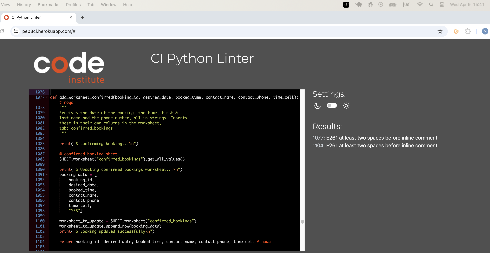

 

Note: No validation was performed on the *.html* and *.js* files that were provided as part of Code Institute's [Python Essentials Template](https://github.com/Code-Institute-Org/python-essentials-template).
### Feature Testing

#### Menu and messaging

<table>
    <tr>
        <th>Feature</th>
        <th>Outcome</th>
        <th>Example</th>
        <th>Pass/Fail</th>
    </tr>
    <tr>
        <td>Front page intro and menu</td>
        <td>Showcases a welcome message, intro and menu to the user</td>
       <td></td>
        <td>Pass</td>
    </tr>
    <tr>
        <td>Navigation banners</td>
        <td>Banners in YELLOW showcase the process the user is starting</td>
       <td></td>
        <td>Pass</td>
    </tr>
    <tr>
        <td>Status messaging (CYAN)</td>
        <td>Shows to the user the actions the program is taking</td>
       <td></td>
        <td>Pass</td>
    </tr>
    <tr>
        <td>Error messaging (RED)</td>
        <td>Provides visual confirmation that user input was incorrect</td>
       <td></td>
        <td>Pass</td>
    </tr>
    <tr>
        <td>Confirming messaging (GREEN)</td>
        <td>Provides visual confirmation of what is available/confirmed</td>
       <td></td>
        <td>Pass</td>
    <tr>
        <td>Booking confirmation</td>
        <td>Provides an overview of the booking that the user made</td>
        <td></td>
        <td>Pass</td>
    </tr>
</table>

#### User option/choices

<table>
    <tr>
        <th>Feature</th>
        <th>Outcome</th>
        <th>Example</th>
        <th>Pass/Fail</th>
    </tr>
    <tr>
        <td>Date choice</td>
        <td>Gives user the option to select a date</td>
        <td></td>
        <td>Pass</td>
    </tr>
        <tr>
        <td>Time choice</td>
        <td>Gives user the option to select a time</td>
        <td></td>
        <td>Pass</td>
    </tr>
    <tr>
        <td>Provide name</td>
        <td>Asks user to fill in their name</td>
        <td></td>
        <td>Pass</td>
    </tr>
    <tr>
        <td>Provide phone number</td>
        <td>Asks user to fill in their phone number</td>
        <td></td>
        <td>Pass</td>
    </tr>
    <tr>
        <td>Find Booking</td>
        <td>Finds the right booking</td>
        <td></td>
        <td>Pass</td>
    </tr>
    <tr>
        <td>Confirm Booking</td>
        <td>Allows user to confirm that the right booking was found</td>
        <td></td>
        <td>Pass</td>
    </tr>
    <tr>
        <td>Editing Date</td>
        <td>Allows user to edit date of original booking</td>
        <td></td>
        <td>Pass</td>
    </tr>
    <tr>
        <td>Editing Time</td>
        <td>Allows user to edit time of original booking</td>
        <td></td>
        <td>Pass</td>
    </tr>
    <tr>
        <td>Editing Contact details</td>
        <td>Allows user to edit name of original booking</td>
        <td></td>
        <td>Pass</td>
    </tr>
    <tr>
        <td>Cancelling booking</td>
        <td>Allows user to cancel their existing booking</td>
        <td></td>
        <td>Pass</td>
    </tr>
    <tr>
        <td>Back to main menu</td>
        <td>Allows for user to stop their action and go back to main</td>
        <td></td>
        <td>Pass</td>
    </tr>
</table>

### User input validation

Error messaging to user input has been tailored to the question asked, meaning that what was entered by the user will be used in the error message itself. In the error message it is stated what went wrong and repeated what is required. Added below are the multi line answers 

NOTE: For NAME and PHONE NUMBER it has been a contious decision to not set up error messaging for when a user provides a name with numbers, or a phone number with letters (or it being too short/long). This due to the various correct ways to 'spell' a phone number. The choice was made to add a line specifically highlighting the need for a valid phone number instead.

| Feature | Tested? | User Feedback Provided |
|---|---|---|
| Main Menu | Yes |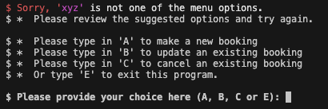|
| Date selection | Yes |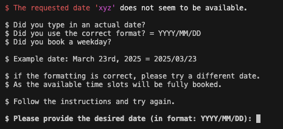|
| Time selection | Yes |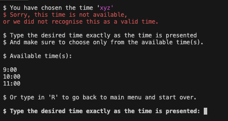|
| Provide name | Yes |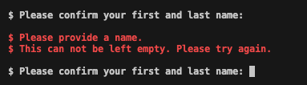|
| Provid phone number | Yes |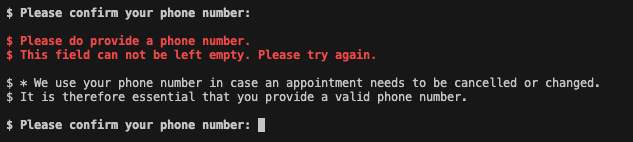|
| Y/N confirmation | Yes |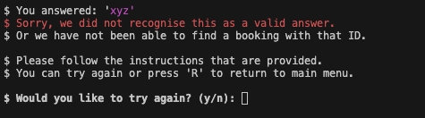 |
| Booking ID | Yes |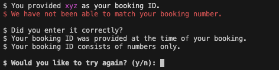|

### Python validator test
The Python code itself has been reviewed with the "flake8" command in VScode. Removing all errors shown in the "run.py" file. Errors however in other files (e.g. .vscode) have gone untouched as these were part of the Code Institute template and were not used/touched by me in the process of building the booking system.

Next to "flake8" the code was also checked with the suggested CI Python Linter. On both tools the initial issues that were shown were about:
    - Using too many charactars in a line (79+), which have been adjusted
    - Unused variables (which I have removed, adjusted or hashtagged out)
    - Whitelines (which were removed)
    - Incorrect indentations (which were updated)

[Back to Table of Contents](#table-of-contents)

## Deployment 

The site was deployed to GitHub Pages. The steps to deploy are as follows:

- In the [GitHub repository](https://github.com/MJRidder/nailstudio_booking), navigate to the Settings tab
- From the source section drop-down menu, select the Main Branch, then click "Save".
- The page will be automatically refreshed with a detailed ribbon display to indicate the successful deployment.

The live link on Heroku can be found [here](https://lous-nailstudio-booking-system-72021c02bd05.herokuapp.com/)

### Local Deployment
This project can be cloned or forked in order to make a local copy on your own system.

### Cloning
You can clone the repository by following these steps:

1. Go to the [GitHub repository](https://github.com/MJRidder/nailstudio_booking)
2. Locate the Code button above the list of files and click it
3. Select if you prefer to clone using HTTPS, SSH, or GitHub CLI and click the copy button to copy the URL to your clipboard
4. Open Git Bash or Terminal
5. Change the current working directory to the one where you want the cloned directory
6. In your IDE Terminal, type the following command to clone my repository:
- git clone https://github.com/MJRidder/nailstudio_booking
7. Press Enter to create your local clone.
Alternatively, if using Gitpod, you can click below to create your own workspace using this repository.

Please note that in order to directly open the project in Gitpod, you need to have the browser extension installed. A tutorial on how to do that can be found [here](https://www.gitpod.io/docs/configure/user-settings/browser-extension).

### Forking
By forking the GitHub Repository, we make a copy of the original repository on our GitHub account to view and/or make changes without affecting the original owner's repository. You can fork this repository by using the following steps:

1. Log in to GitHub and locate the [GitHub repository](https://github.com/MJRidder/nailstudio_booking)
2. At the top of the Repository (not top of page) just above the "Settings" Button on the menu, locate the "Fork" Button.
3. Once clicked, you should now have a copy of the original repository in your own GitHub account!

### Heroku deployment

1. Go to the Heroku dashboard.
2. Click on the "Create new app" button.
3. Name the app uniquely (e.g., "love-sandwiches").
4. Select the appropriate region.
5. Click on "Create app".
6. Navigate to the "Settings" tab.
7. Under "Config Vars", add a new config var with the key "CREDS" and copy the contents of the creds.json file from your workspace into the value field.
8. Click on "Add".
9. Add two buildpacks: Python and node.js. Ensure Python is on top.
10. Navigate to the "Deploy" section.
11. Choose the deployment method (e.g., Github).
12. Connect to your Github repository.
13. Select the repository name.
14. Click on "Connect".
15. Choose either automatic deploys or manual deploys.
16. If manual, select the branch to deploy.
17. Wait for the deployment process to complete.
18. Check the deployment logs for any errors.
19. Test the deployed application to ensure it works correctly.
20. Verify functionality with both correct and incorrect data inputs.

Project deployed!

[Back to Table of Contents](#table-of-contents)

## Unfixed bugs 

The booking system should no longer have any existing bugs. However there are a few configurations that can/need to be done to make it run better. Most notable is the further splitting out of functions.

### Make larger functions smaller
It is an improvement that will better the booking tool as a whole. To make the tool more accessable for different companies, breaking up larger tools, will be beneficial for the larger use. Examples of this (and that in part go against the DRY principle at this piont) are error messages. They are often very similar and although in some cases a unique error message is required to make the program more specific, there is overlapping messaging that could be simplified.

## Credits 

### Tools Used

| Source | Use | Notes |
| --- | --- | --- |
| [Github](https://github.com/j) | Tool hosting | Hosting |
| [GitPod](https://openai.com/index/chatgpt/) | Tools creation | Creation/testing |
| [Herou](https://openai.com/index/chatgpt/) | Tool hosting | Creation/testing |
| [ChatGPT](https://openai.com/index/chatgpt/) | Support | Code review/adjustments |

### Resources Used

| Source | Location | Notes |
| --- | --- | --- |
| [W3schools](https://www.youtube.com/watch?v=riDzcEQbX6k) | Coding | Python funcionality info |
| [Youtube](https://www.youtube.com/) | Coding | Python funcionality info |
| [Stack Overflow](https://stackoverflow.com/) | Coding | Python funcionality info |
| [CI Love Sandwiches](https://mjridder.github.io/love-sandwiches/) | Coding | code structure |
| [CI quizprep](https://mjridder.github.io/love-maths/) | Readme | inspiration |
| [Flexibook](https://github.com/abikirkham/FlexiBook) | Coding | inspiration for code/readme |
| [Code Institute](https://learn.codeinstitute.net/ci_program/disdcc_2) | Coding | Course material |
| [Budget Buddy](https://github.com/Sarah-Bue/budget-buddy/) | Readme | Testing example |

Special shout outs:
1. First to my mentor [Sheryl Goldberg](https://github.com/sherylg343) for being available for our mentor sessions. I benefit greatly from her motivation, her ideas and suggestions. It has been of great value, walking with her through my start of the project, get her insights half way and get her final notes just before submitting my project.
2. My wife Lou for getting excited for trying out doing her own nails and purchasing all needed equipment. Which was the inspiration for me to create this booking system.
3. The unknown to me assessor who provided valuable tips and learnings in the feedback. Receiving a Fail on your first try is never fun, but often the best way to learn, is to fail first and learn from you mistakes. I hope that I have been able to show with my adjustments that this has been the case.

[Back to Table of Contents](#table-of-contents)