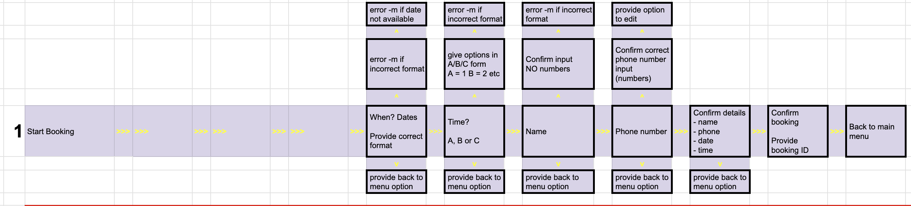

Welcome,

This is the Code Institute student template for deploying your third portfolio project, the Python command-line project. The last update to this file was: **May 14, 2024**

## Reminders

- Your code must be placed in the `run.py` file
- Your dependencies must be placed in the `requirements.txt` file
- Do not edit any of the other files or your code may not deploy properly

## Creating the Heroku app

When you create the app, you will need to add two buildpacks from the _Settings_ tab. The ordering is as follows:

1. `heroku/python`
2. `heroku/nodejs`

You must then create a _Config Var_ called `PORT`. Set this to `8000`

If you have credentials, such as in the Love Sandwiches project, you must create another _Config Var_ called `CREDS` and paste the JSON into the value field.

Connect your GitHub repository and deploy as normal.

## Constraints

The deployment terminal is set to 80 columns by 24 rows. That means that each line of text needs to be 80 characters or less otherwise it will be wrapped onto a second line.

---

Happy coding!
#############################################################################################

# Lou's nail studio - about the page
This project is a simple booking system for a fictional nail studio called "Lou's nail studio." The aim of the system is to allow for bookings to be made, existing bookings being edited and existing bookings being cancelled. All tracked and updated in a Google Sheet database. The tool and database is accessable online, so can be viewed when on the move and is not bound to a specific machine. By using Google sheets, the user will have several options to extend it's functionalities. For example linking it to their Gmail or Google calendar.

The project is hosted on Github and deployed on Heroku for easy access, sharing an collaboration. 

[Live site](https://lous-nailstudio-booking-system-72021c02bd05.herokuapp.com/)

[Repository link](https://github.com/MJRidder/nailstudio_booking)

## Table of Contents

1. [User Experience](#user_experience)
2. [Design](#design)
3. [Features](#features)
4. [Technologies Used](#technologies_used)
5. [Creating a Google Spreadsheet and Integrating it using API](#creating_a_google_spreadsheet_and_integrating_it_using_api)
6. [Google Sheets](#google_sheets)
7. [Deployment](#deployment)
8. [Browser Capability](#browser_capability)
9. [Testing](#testing)
10. [Bugs](#bugs)
11. [Credits](#credits)

## User experience

### Business goals
* Have an online tool that allows for:
    - business to be generated (bookings) at any given time of the day
    - existing bookings to be updated as per clients preference
    - tracking of all upcoming bookings (dates & times)
    - an overview of all cancelled bookings
    - integration with a back end database (Google Sheets)
* Clients to book/edit/cancel bookings without human interaction
* Have a tool that integrates easily with a front-end website
* Have a tool that can be used in collaboration with other functions (email/calendar planning)

### User goals
* Quick and easy booking of nail appointments
* Quick and easy editing/cancelling of existing bookings
* Quick and easy way to check availability for a nail appointment
* Ability to make a booking at any given moment in time

## Design
The design has purposefully kept simple and to the point. Not asking the user for extensive answers, but navigating through the system by answering with 2-4 option buttons (letter or times). Formatting of how an answer is expected is clarified before each question. It is also repeated where this is needed.

Every step in the process has been reviewed for the users best experience. Ensuring they have options to go back to the main menu with every question. Giving them the ability to go back and not get stuck in the system.

Flowchart of making a booking 

Flowchart of editing a booking

Flowchart of canceling a booking

There has been made a concideration up front as well as to how the different flowcharts could make use of the same functions to avoid duplication

Alignment of all flowcharts

### User stories
This Nail studio booking system has been developed to allow for clients of "Lou's nail studio" to check for availability, review their own bookings and to make/edit bookings at any point in time that they desire. Allowing for flexibility and on online option for such adjustments. Which is especially relevant today where people are less likely to pick up the phone. Or at the very least, less enjoy doing so.

### UX experience

### Wireframes/workflows (excel screenshots)
example

## Features

### Example feature 1
The navigation bar is adaptable for smaller and larger screens. Making use of the "hamburger" menu for mobile and adding the homepage/contact links written out at the top of the page for larger devices. It still allows space for more menu options. Currently the different quizzes are also added for easy navigation while working on the site. However with the 'hidden class' added, they are only visible when desired, not for the users.

NAV bar for larger devices 

NAV bar closed and open for mobilie devices 

NAV bar Gitpod code with hidden menu

ebook, instagram, X (Twitter), Snapchat and Tiktok social media's, the footer has already been added with links to various social accounts. This will be updated when social media pages are created. These social media pages can in turn be used to make followers aware of new quizzes and to provide shareable links to Quizprep to expand the user base.

## Future features

### Future feature 1

## Testing * TO BE UPDATED
Testing of the various pages has been an ongoing process. Ensuring that mobile comes first has the benefit that overall the pages are tailored for it and will indeed look most streamlined on mobile. Through media queries the pages have been adapted to different screen sizes.

Testing has been performed on actual (Macbook 16 inch )laptops and phone screens (Samsung 8 & Samsung Galaxy S23).

[Am I responsive? view](https://ui.dev/amiresponsive?url=https://mjridder.github.io/QuizPrep/index.html)

### Python validator test

## (Un)fixed bugs

### bug 1

## Deployment

The site was deployed to GitHub Pages. The steps to deploy are as follows:

- In the [GitHub repository](https://github.com/MJRidder/QuizPrep), navigate to the Settings tab
- From the source section drop-down menu, select the Main Branch, then click "Save".
- The page will be automatically refreshed with a detailed ribbon display to indicate the successful deployment.

The live link can be found [here](https://mjridder.github.io/QuizPrep/)

### Local Deployment
This project can be cloned or forked in order to make a local copy on your own system.

### Cloning
You can clone the repository by following these steps:

1. Go to the [GitHub repository](https://github.com/MJRidder/QuizPrep)
2. Locate the Code button above the list of files and click it
3. Select if you prefer to clone using HTTPS, SSH, or GitHub CLI and click the copy button to copy the URL to your clipboard
4. Open Git Bash or Terminal
5. Change the current working directory to the one where you want the cloned directory
6. In your IDE Terminal, type the following command to clone my repository:
- git clone https://github.com/MJRidder/QuizPrep
7. Press Enter to create your local clone.
Alternatively, if using Gitpod, you can click below to create your own workspace using this repository.

Please note that in order to directly open the project in Gitpod, you need to have the browser extension installed. A tutorial on how to do that can be found [here](https://www.gitpod.io/docs/configure/user-settings/browser-extension).

### Forking
By forking the GitHub Repository, we make a copy of the original repository on our GitHub account to view and/or make changes without affecting the original owner's repository. You can fork this repository by using the following steps:

1. Log in to GitHub and locate the [GitHub repository](https://github.com/MJRidder/QuizPrep)
2. At the top of the Repository (not top of page) just above the "Settings" Button on the menu, locate the "Fork" Button.
3. Once clicked, you should now have a copy of the original repository in your own GitHub account!

## Local VS Deployment
There are no differences between my local and deployed site currently.

## Credits

### Tools Used

| Source | Location | Notes |
| --- | --- | --- |
| [Github](https://github.com/j) | Site creation | Website building |
| [ChatGPT](https://openai.com/index/chatgpt/) | JS/CSS/HTML | Code review/adjustments |

### Resources Used

| Source | Location | Notes |
| --- | --- | --- |
| [W3schools](https://www.youtube.com/watch?v=riDzcEQbX6k) | Quizprep | HTML/CSS coding |

Special shout outs:
1. First to my mentor [Sheryl Goldberg](https://github.com/sherylg343) 

### Content/Media Used

| Source | Location | Notes |
| --- | --- | --- |
| [Variety](https://variety.com/) | Quizpage | Images |
